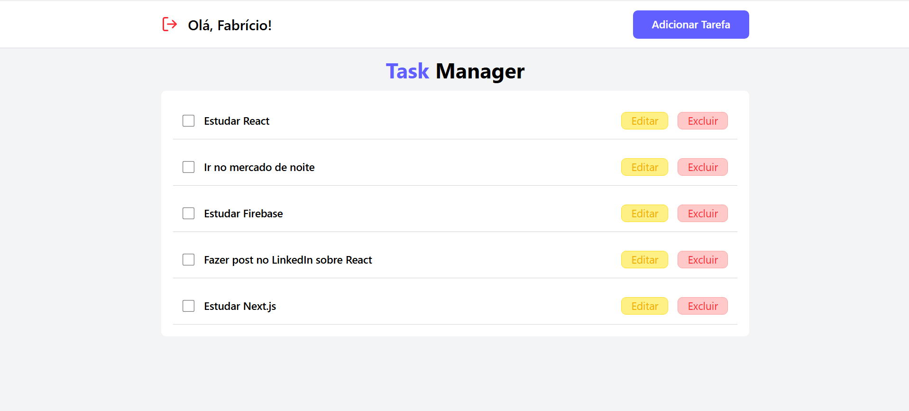
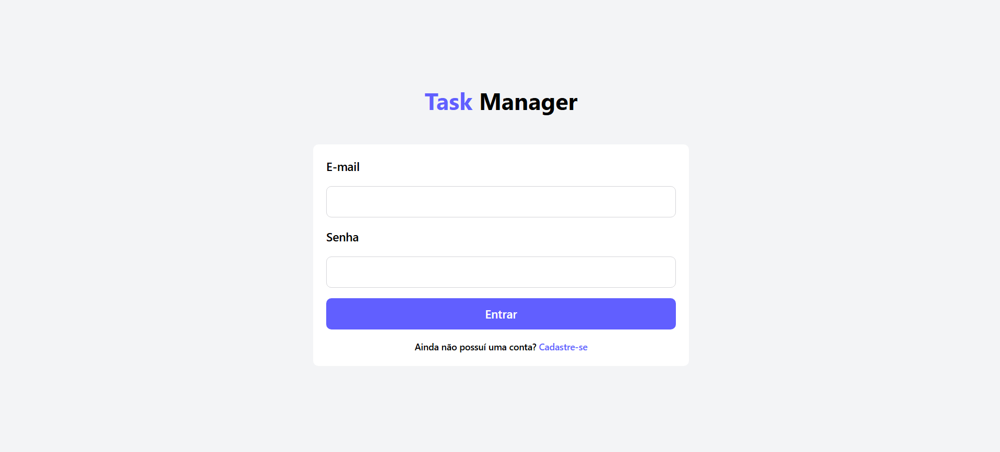

# 📝 Task Manager - Plataforma de Gerenciamento de Tarefas

Task Manager é uma plataforma web moderna para gerenciamento de tarefas, desenvolvida com React, TypeScript e Firebase. O sistema permite que usuários cadastrem, visualizem e editem tarefas de forma simples, intuitiva e responsiva.

## 📸 Screenshots

### Dashboard



### Login



## 🚀 Tecnologias Utilizadas

- React.js
- TypeScript
- Firebase (Firestore, Auth)
- React Router
- React Icons
- React Hook Form
- Zod (Validação)
- Tailwind CSS

## 📁 Estrutura do Projeto

```
webcarros/
├── src/
│   ├── components/             # Componentes reutilizáveis
│   │   ├── editTaskModal/      # Modal de edição
│   │   ├── header/             # Cabeçalho
│   │   ├── input/              # Input de formulário
│   │   ├── layout/             # Layout do site
│   │   └── newTaskModal/       # Modal de criação
│   ├── contexts/               # Contextos React
│   │   └── AuthContext/        # Contexto de autenticação
│   ├── pages/                  # Páginas da aplicação
│   │   ├── dashboard/          # Painel do usuário
│   │   ├── login/              # Página de login
│   │   └── register/           # Página de registro
│   ├── routes/                 # Rotas
│   │   ├── Private/            # Proteção de rotas
│   └── services/               # Serviços externos
│       └── firebaseConnection/ # Configuração do Firebase
├── public/                     # Arquivos públicos
└── package.json                # Dependências e scripts
```

## ⚙️ Funcionalidades

- 🔐 Autenticação de usuários
- 📝 Cadastro de tarefas
- 📱 Interface responsiva
- 📊 Gerenciamento de tarefas
- ✅ Validação de formulários
- 🎨 Design moderno e intuitivo

## 🛠️ Como Executar

1. Clone o repositório:

```bash
git clone https://github.com/fcdias0812/taskmanager.git
```

2. Instale as dependências:

```bash
cd taskmanager
npm install
```

3. Configure as variáveis de ambiente:
   Crie um arquivo `.env` na raiz do projeto com as configurações do Firebase:

```
REACT_APP_API_KEY=sua_api_key
REACT_APP_AUTH_DOMAIN=seu_auth_domain
REACT_APP_PROJECT_ID=seu_project_id
REACT_APP_STORAGE_BUCKET=seu_storage_bucket
REACT_APP_MESSAGING_SENDER_ID=seu_messaging_sender_id
REACT_APP_APP_ID=seu_app_id
```

4. Execute o projeto:

```bash
npm run dev
```

O projeto estará disponível em `http://localhost:5173`

## 🔧 Configuração do Firebase

1. Crie um projeto no [Firebase Console](https://console.firebase.google.com)
2. Ative a autenticação por email/senha
3. Crie um banco de dados Firestore
4. Configure o Storage para upload de imagens
5. Copie as credenciais do projeto para o arquivo `.env`

## 📝 Licença

Este projeto está sob a licença MIT. Veja o arquivo [LICENSE](LICENSE) para mais detalhes.

## 👥 Contribuição

1. Faça um Fork do projeto
2. Crie uma Branch para sua Feature (`git checkout -b feature/AmazingFeature`)
3. Faça o Commit das suas mudanças (`git commit -m 'Add some AmazingFeature'`)
4. Faça o Push para a Branch (`git push origin feature/AmazingFeature`)
5. Abra um Pull Request

## 📧 Contato

Fabrício Dias - [@fcdias0812](https://www.linkedin.com/in/fcdias0812/) - dias.fabricio0812@gmail.com
